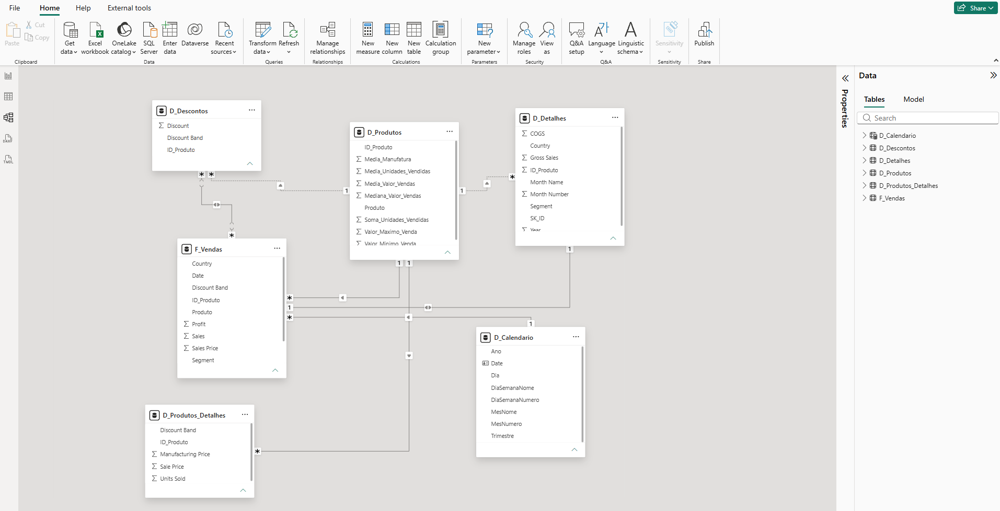

# Star Schema — Financial Sample (Power BI)

Projeto da formação **Power BI Analyst (Santander/DIO)**: transformação da tabela única *Financial Sample* em um modelo dimensional (star schema), com tabela calendário criada via DAX.

## Diagrama

## Estrutura do modelo

| Tabela | Papel | Conteúdo |
|---|---|---|
| `financials_origem` | Backup oculto | Cópia da tabela original, sem carga no modelo |
| `D_Produtos` | Dimensão | `ID_Produto`, Produto, e estatísticas agregadas (média/mediana/máx/mín de vendas, soma e média de unidades vendidas, média de manufatura) |
| `D_Produtos_Detalhes` | Dimensão | `ID_Produto`, Discount Band, Sale Price, Units Sold, Manufacturing Price |
| `D_Descontos` | Dimensão | `ID_Produto`, Discount, Discount Band |
| `D_Detalhes` | Dimensão | Colunas remanescentes da tabela original: Country, COGS, Gross Sales, Segment, Month Name, Month Number, Year, SK_ID |
| `D_Calendario` | Dimensão de tempo | Criada via DAX (`CALENDAR`), marcada como Date Table |
| `F_Vendas` | Fato | SK_ID, ID_Produto, Produto, Date, Units Sold, Sales Price, Discount Band, Segment, Profit, Sales |

## Processo de construção

1. **Backup da origem**: a tabela original foi duplicada como `financials_origem` e teve o carregamento desativado (Enable Load), permanecendo como referência sem entrar no modelo.

2. **Criação do `ID_Produto`**: coluna de índice sequencial (Index Column) aplicada sobre os produtos já agrupados, numerando de 0 a 5 (Carretera=0, Montana=1, Paseo=2, Velo=3, VTT=4, Amarilla=5).

3. **Agrupamento (`D_Produtos`)**: uso de *Group By* (avançado) sobre a coluna Product, agregando: soma e média de unidades vendidas, média/mediana/máximo/mínimo de Sale Price, e média de Manufacturing Price.

4. **Tabelas de detalhe**: `D_Produtos_Detalhes` e `D_Descontos` derivadas da tabela original, mantendo o grão de venda (uma linha por transação), sem agregação.

5. **`D_Detalhes`**: reúne as colunas que não couberam nas demais dimensões (Country, COGS, Gross Sales, Segment, informações de mês/ano e o `SK_ID`, usado como chave 1:1 com a Fato).

6. **`F_Vendas`**: recebe o `SK_ID` (índice sequencial) e as métricas centrais de negócio (Units Sold, Sales Price, Profit, Sales, Discount Band).

7. **`D_Calendario` via DAX**: tabela
